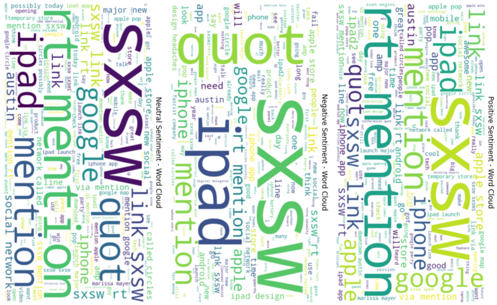
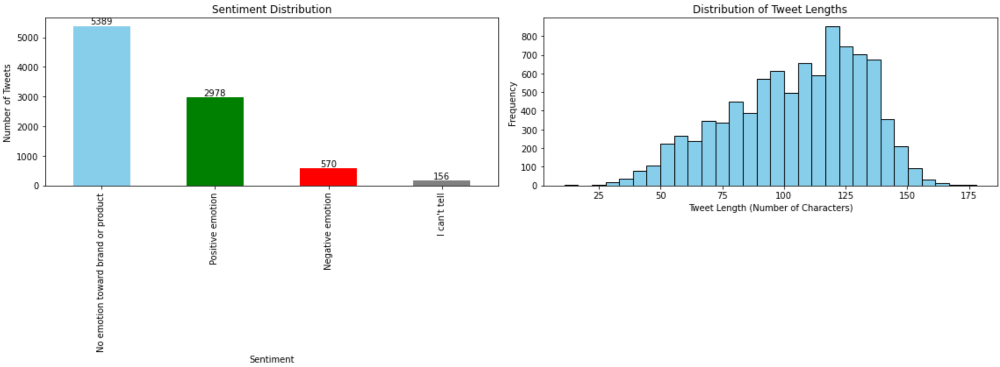
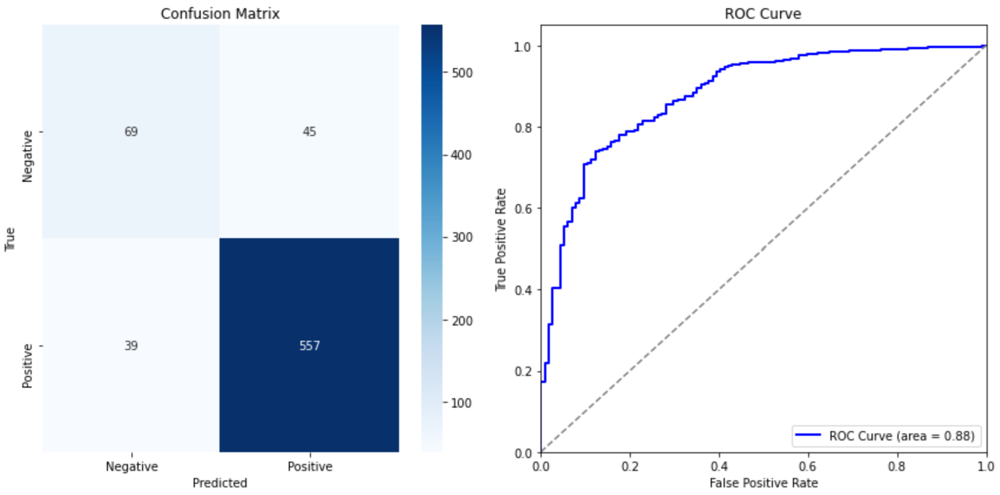
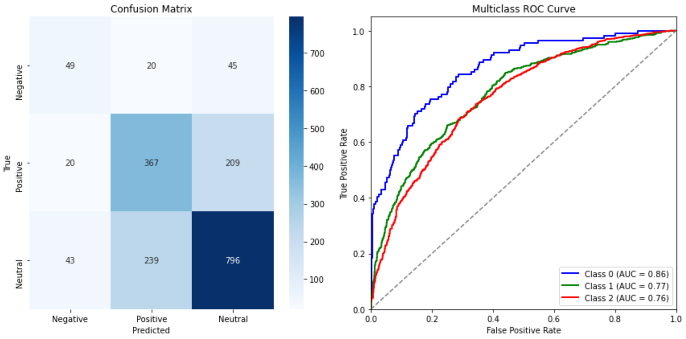

# Tweet Text Sentiment Analysis Project
**Authors:** Phase4_Group6: *Mary Musyoka, Julian Kilyungi, Tabitha Kariuki, John Kul, Norah Oluoch and Joseph Ngige.*

## Project Overview

This project develops an NLP model to analyze sentiment in over 9,000 Tweets related to Apple and Google products, labeled as positive, negative, or neutral. The goal is to create a robust sentiment classification model that predicts sentiment based on Tweet content, providing actionable insights for Apple and Google’s marketing and product development teams to better understand consumer perception, identify trends, and enhance engagement.

### Objectives:
1. **Sentiment Classification**: Build a models to classify Tweets as positive, negative, or neutral, aiding sentiment analysis for Apple and Google.
2. **Model Performance**: Optimize both binary (positive vs. negative) and multiclass (positive, negative, neutral) classifications.

Two classification approaches—binary (positive vs. negative) and multiclass (positive, negative, neutral)—were implemented using models like Logistic Regression, Random Forest, and SVM for binary classification, and Multinomial Naive Bayes with an ensemble model for multiclass classification.

## Business Understanding

* **Stakeholder:** The primary stakeholders are the marketing and product development teams at Apple and Google. These teams seek to understand public sentiment towards their products to guide marketing strategies, product enhancements, and customer engagement initiatives.

* **Business Problem:** Apple and Google aim to monitor and analyze general consumer sentiment on social media platforms to gauge public perception and identify trends in how their products are received. A generalized sentiment analysis model based on Tweet content will help them quickly assess whether social media conversations about their products are positive, negative, or neutral. This will allow them to respond to broad public opinion more effectively, identify potential marketing opportunities, and enhance customer engagement.

## Data Understanding

* **Dataset:** The project utilizes a dataset from [CrowdFlower](https://data.world/crowdflower/brands-and-product-emotions) via data.world, containing over 9,000 Tweets about Apple and Google products. Each Tweet annotated by human raters with a sentiment classification: positive, negative, or neutral.

* **Suitability:** This dataset is well-suited for the business problem as it provides a sizable and diverse collection of real-time consumer opinions. The multi-class sentiment labels facilitate both binary (positive/negative) and multi-class classification tasks, allowing for scalable model development.

## Data Exploration & Preparation

The dataset contained 9,093 entries and three key columns: tweet_text, emotion_in_tweet_is_directed_at, and sentiment labels. Due to 5,802 missing values in the emotion_in_tweet_is_directed_at column, it was dropped, along with one row missing tweet_text. The sentiment distribution showed an imbalance, with most tweets having no emotion, followed by positive and negative emotions, prompting the use of class-balancing techniques.

Tweet length analysis revealed most tweets were of moderate length, aligning with Twitter's constraints. Pre-processing included converting text to lowercase, removing punctuation, tokenizing, removing stopwords, and lemmatizing. Afterward, the data was split into an 80/20 train-test set and transformed using TF-IDF vectorization. SMOTE was applied to balance the classes for robust sentiment classification model development.

*The sentiment distribution is imbalanced, with most tweets having no emotion or positive sentiment as per the chart on the left, while tweet lengths mostly fall within a moderate range as per chart on the right, negating the need for truncation during tokenization.*

## Modeling

### Binary Classification Models

In this project, multiple binary classification models were trained to predict sentiment in Tweets about Apple and Google products. The models included **Logistic Regression**, **Random Forest**, and **Support Vector Machine (SVM)**. After tuning, **Logistic Regression** emerged as the best overall performer, achieving an accuracy of **88%**. Its strength lay in its ability to detect negative sentiments, with a recall of **0.61** and an F1-score of **0.62**—both outperforming SVM and Random Forest. While **SVM** had a slightly higher accuracy of **89%**, its lower recall and F1-score for negative sentiments made it less reliable for capturing this challenging class. Random Forest, with its recall of **0.36**, struggled similarly. Therefore, **Logistic Regression** was chosen as the most balanced model for binary sentiment analysis.

*The confusion matrix shows strong identification of positive tweets with few false negatives, while the ROC curve's AUC of 0.88 indicates that the logistic regression model has good discriminatory power in distinguishing between positive and negative classes*

### Multiclass Classification Models

For the multiclass sentiment classification task, two models were trained: **Multinomial Naive Bayes** and an **ensemble model** combining Multinomial Naive Bayes and Random Forest. The ensemble model achieved superior results, with an accuracy of **68%**, compared to Naive Bayes' **61%**. It performed better across all sentiment classes, particularly in improving the detection of negative sentiments and capturing neutral emotions. With a more balanced performance across positive, negative, and neutral classes, the ensemble model proved to be the preferred choice for multiclass sentiment classification, offering more reliable results for real-world applications.

*The confusion matrix and AUC scores indicate the model performs well in distinguishing negative tweets but struggles with higher misclassification rates between neutral and positive tweets, leading to moderate but less reliable performance for these classes.*

### Model Evaluation Metrics

The evaluation metrics used included Accuracy (proportion of correctly classified instances (both positive, negative, and neutral sentiments) out of the total instances), Precision (ratio of correctly predicted positive instances to the total instances predicted as positive), Recall (model's ability to identify all relevant instances of a class) and F1-Score (harmonic mean of precision and recall, providing a balanced metric when both precision and recall are important). The higher the metric, the better.

In the context of generalized sentiment analysis, **F1-score** would be the most important metric to consider, as it balances both **precision** and **recall**. Given that the dataset includes several classes, it is crucial not only to correctly classify the sentiments (precision) but also to capture as many relevant examples of each class as possible (recall). F1-score helps ensure that the model performs well across different classes without favoring one over the others, which is particularly important in cases of class imbalance like this one. Thus, while accuracy provides a general overview, the F1-score offers a more nuanced view of model performance across all sentiment categories.

We also included a confusion matrix (to show the true and predicted classes for each category) and AUC-ROC (to plot the true positive rate (recall) against the false positive rate at various threshold levels) charts for best performing models in each classification category.

## Conclusion

This project successfully developed NLP sentiment classification models to analyze consumer sentiment on Twitter. Logistic Regression excelled in binary classification, achieving 88% accuracy, particularly strong in detecting negative sentiment, which is crucial for identifying areas needing improvement. For multiclass classification, the ensemble model (Multinomial Naive Bayes + Random Forest) outperformed the standalone Naive Bayes, achieving 68% accuracy with balanced performance across positive, negative, and neutral sentiments. When deployed, these models will help provide actionable insights for Apple and Google stakeholders, helping them make informed decisions about products and customer engagement.

### Recommendations:
- **Enhance Negative Sentiment Detection**: Explore advanced methods like **phrase extraction** or models like BERT to capture nuanced negative expressions.
- **Address Class Imbalance**: Collect more diverse data to improve representation of underrepresented sentiment classes, especially negative sentiment.
- **Refine Pre-processing**: Implement more sophisticated techniques, such as handling negations and domain-specific language.
- **Ongoing Monitoring and Retraining**: Regularly update the model to ensure accuracy as consumer sentiment evolves.